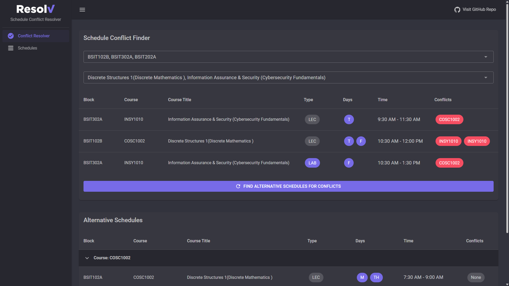
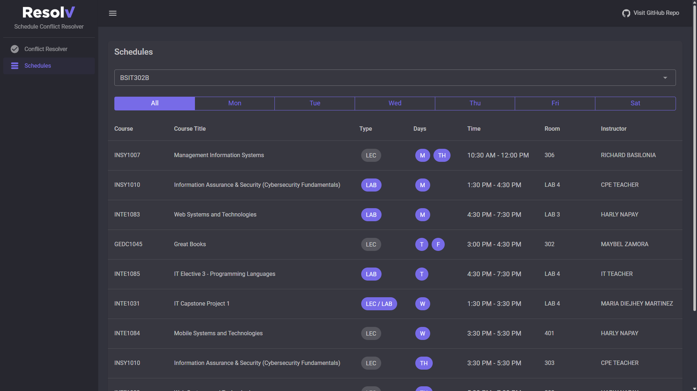
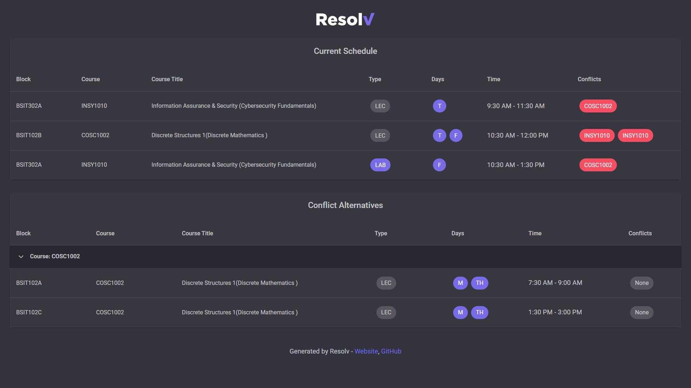

<h2 align="center">Resolv - A Conflict Resolver for STI College Legazpi Tertiary IT Students</h2>

    
    
    
    

Resolv can automatically detect conflicting course schedules and suggest
appropriate changes to limit or fully avoid schedule conflicts. It can
also provide all course schedules for each blocks, including the ability
to filter course schedules by day. You can also share your schedule conflict
resolver recommendations to anyone!

### :sparkles: Demo

### :camera: Screenshots

Conflict Resolver

Schedules

Shared Schedule Preview

